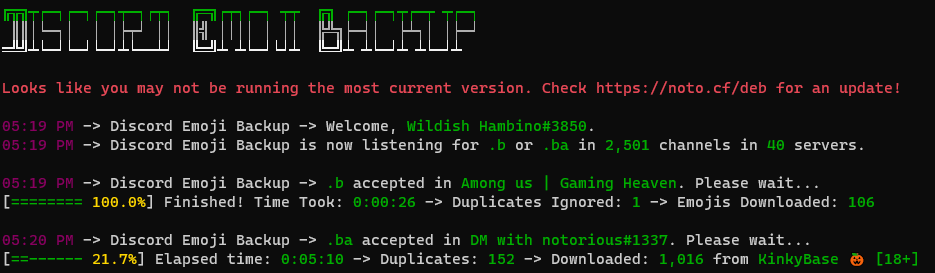

# Discord Emoji Backup
 Discord Emoji Backup is a utility that allows you to create a backup of the emojis from your Discord server or all of the Discord servers your Discord account is in.
 
 [](https://github.com/noto-rious/DEB/releases)


### Settings
Edit `settings.json`
```
{
  "token":"Token_Here", // Replace Token_Here with your user token.
  "command_prefix":".", // This is the command prefix for your trigger commands(.b, .ba)
  "keep_dir":"false", // If this value is set to true it will append emojis to the folders rather than mirroring backups.
  "no_dupes":"true" // If this value is set to true it will filter duplicate emojis using SHA1 checksums.
}
```
***
### How to obtain your token
https://github.com/Tyrrrz/DiscordChatExporter/wiki/Obtaining-Token-and-Channel-IDs#how-to-get-a-user-token
***
### Disclaimer
This is a self-bot which is against Discord ToS. Use it at your own risk.
